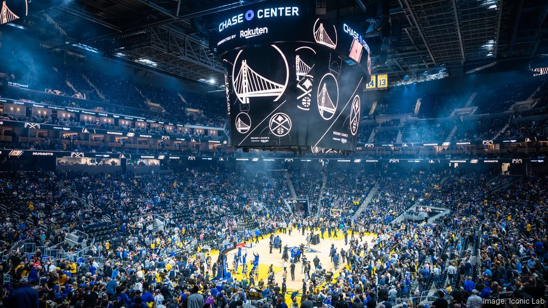

# UCSD HSDI DSC148 Final Prject

## Predicting NBA Shot Success and Estimating Player Shooting Efficiency from Shot Context

  

### Research question:
Can shot location and game context predict whether an NBA shot attempt will be made?
